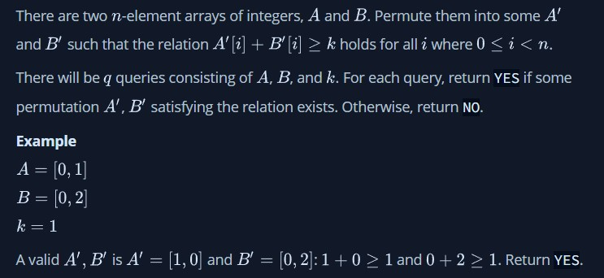
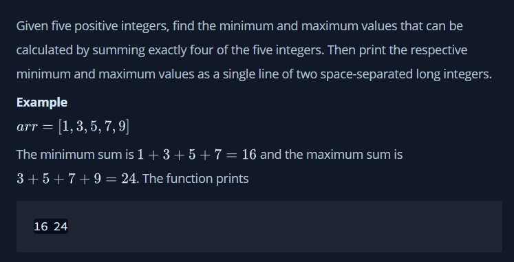
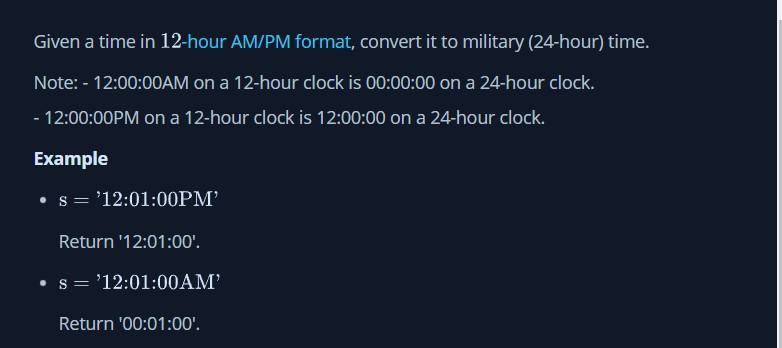

### Challenges HackerRank

This readme contain the statements of each challange done; the challenges were resolved using 2 programming languages JavaScript and Python.

1. Challenge 1 - Permuting two arrays

2. Challenge 2 - Min Max sum

3. Challenge 3 - Time Conversion

